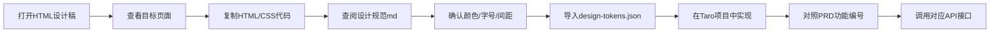

# UI设计文件夹

> **版本**: v4.0  
> **更新日期**: 2026-07-22  
> **说明**: 本文件夹包含酷酷儿童故事的 UI 设计交付物。**v4.0 已定稿**：[`酷酷UI_融合版_v4.html`](酷酷UI_融合版_v4.html)（典藏绘本 · 日夜双主题 · 24屏 · 真实封面管线）；A~I 等概念稿为探索存档。

---

## 🚀 快速开始

### 1️⃣ 查看定稿设计（开发主参考）

打开 [`酷酷UI_融合版_v4.html`](酷酷UI_融合版_v4.html)：
- ✅ 用浏览器打开（Chrome/Edge/Safari）
- ✅ 24 屏高保真：故事/歌曲/成长/家长/播放器/睡前/登录/会员/状态 全覆盖
- ✅ 全部使用 `production/illustrations/` 真实封面、16:9 场景图与角色立绘
- ✅ 按 Ctrl+F 搜索页面编号（如"S-01"、"PL-01"、"G-01"）快速定位

**修改设计**：编辑 [`_build_v4.py`](_build_v4.py) 后运行 `python _build_v4.py` 重新生成（自动校验封面路径缺失）。

**定稿配方**（融合 13 套概念评审之长）：
典藏绘本叙事（故事灯/书匣/收集册）· 日夜双主题（睡前滑入深夜蓝）· 真实封面管线 · 中文衬线标题 · 全 SVG 图标 · 家长区雾面轻奢。

### 2️⃣ 概念稿存档（已定稿，仅作参考）

| 方案 | 文件 | 一眼特征 |
|:--|:--|:--|
| A 绘本夜灯 | `概念A_绘本夜灯.html`（已归档删除） | 深色夜空 + 暖橙灯感（→ 已融入 N-01 睡前模式） |
| B 角色乐园 | `概念B_角色乐园.html`（已归档删除） | IP 角色出场 + 软纸纹 |
| C 软陶海报 | `概念C_软陶海报.html`（已归档删除） | 2 列大海报，低饱和 |
| D 晴空操场 | `概念D_晴空操场.html`（已归档删除） | 天蓝草绿贴纸感 |
| G 雾面丝绸 | `概念G_雾面丝绸.html`（已归档删除） | 柔雾玻璃（→ 已融入 C-01 家长中心） |
| H 北欧书斋 | `概念H_北欧书斋.html`（已归档删除） | 编辑排版杂志级 |
| I 深夜画廊 | `概念I_深夜画廊.html`（已归档删除） | 博物馆黑象牙金 |
| 典藏绘本 | `酷酷UI_典藏绘本版.html`（已归档删除） | 故事灯叙事（→ v4 主骨架） |

### 2️⃣ 阅读设计规范

打开 [`UI设计方案.md`](UI设计方案.md)：
- 📐 了解色彩、字体、圆角、间距等设计规范
- 🎨 了解组件规范（按钮、卡片、标签等）
- 📱 了解响应式设计和无障碍规范
- 🔗 查看跨文档引用映射（UI ↔ PRD ↔ API）

### 3️⃣ 使用设计令牌（可选）

打开 [`design-tokens.json`](design-tokens.json)：
- 🎯 前端项目可直接导入此文件
- 🎯 自动生成CSS变量或Theme配置
- 🎯 保证颜色、字号等与设计稿一致

**Taro项目使用示例**：
```javascript
import tokens from './design-tokens.json'

// 在 CSS 中使用
.button {
  background: ${tokens.colors.primary};
  border-radius: ${tokens.radius.large};
}
```

### 4️⃣ 开始开发

参考 [`../08-本地开发实施步骤.md`](../08-本地开发实施步骤.md)：
- 环境搭建
- 建表SQL
- 逐步落地指南

---

## 📁 文件说明

| 文件 | 类型 | 用途 | 重要程度 |
|:--|:--|:--|:--|
| 酷酷UI_融合版_v4.html | HTML/CSS | **定稿主稿**（24屏·真实封面·日夜双主题） | ⭐⭐⭐⭐⭐ |
| _build_v4.py | Python | 定稿构建脚本（修改后运行重新生成主稿） | ⭐⭐⭐⭐ |
| 酷酷UI设计稿_优化版.html | HTML/CSS | 旧版 v2.1（结构历史参考） | ⭐⭐⭐ |
| 概念A_绘本夜灯.html | HTML/CSS | 视觉方案 A · 全量概念 | ⭐⭐⭐⭐ |
| 概念B_角色乐园.html | HTML/CSS | 视觉方案 B · 全量概念 | ⭐⭐⭐⭐ |
| 概念C_软陶海报.html | HTML/CSS | 视觉方案 C · 全量概念 | ⭐⭐⭐⭐ |
| 概念D_晴空操场.html | HTML/CSS | 视觉方案 D · 全量概念 | ⭐⭐⭐⭐ |
| 概念E_水墨书房.html | HTML/CSS | 视觉方案 E · 全量概念 | ⭐⭐⭐⭐ |
| 概念F_积木电台.html | HTML/CSS | 视觉方案 F · 全量概念 | ⭐⭐⭐⭐ |
| 概念G_雾面丝绸.html | HTML/CSS | 视觉方案 G · 高级感 | ⭐⭐⭐⭐ |
| 概念H_北欧书斋.html | HTML/CSS | 视觉方案 H · 高级感 | ⭐⭐⭐⭐ |
| 概念I_深夜画廊.html | HTML/CSS | 视觉方案 I · 高级感 | ⭐⭐⭐⭐ |
| 酷酷UI设计稿.html | HTML/CSS | 旧版 v2.0（已被优化版取代） | ⭐⭐ |
| UI设计方案.md | Markdown | **设计规范文档** | ⭐⭐⭐⭐⭐ |
| components-guide.md | Markdown | **组件库详细指南** | ⭐⭐⭐⭐ |
| design-tokens.json | JSON | **设计令牌**（选型后需同步） | ⭐⭐⭐⭐ |
| README.md | Markdown | **使用指南**（本文档） | ⭐⭐⭐

---

## 🎨 插画图标资产登记表（小程序在用）

> 规则：源图统一存 `production/illustrations/covers/generated/`（含 `新建文件夹/` 命名图标）；
> 压缩产物（96px PNG / 压缩 JPG）存 `miniapp/src/assets/`。新增图标必须先压缩再用，并在此登记。

| 产物（miniapp/src/assets/） | 源图 | 使用位置 |
|:--|:--|:--|
| tab_story/song/growth/parent.png | 故事/歌曲/成长/家长.png | 底部 TabBar 4 图标 |
| login_hero.jpg / login_hero2.jpg | 载入1/2.png | 登录页全屏插画 |
| icon_search.png | 新建文件夹/搜索.png | 故事/歌曲首页搜索、成长页搜字/词 |
| icon_night.png / icon_day.png | 新建文件夹/夜间.png / 白天.png | 首页夜间开关（两态：夜间已开显白天图）、设置页 |
| icon_playing.png / icon_play_ready.png | 新建文件夹/播放中.png / 准备播放.png | 迷你播放浮球 |
| icon_fav.png | 新建文件夹/收藏.png | 家长中心-收藏管理 |
| icon_history.png | 新建文件夹/播放历史.png | 家长中心-播放历史 |
| icon_children.png | 新建文件夹/孩子档案.png | 家长中心-孩子档案、孩子档案页 |
| icon_settings.png | 新建文件夹/账号设置.png | 家长中心-账号设置 |
| icon_privacy.png | 新建文件夹/隐私与账号注销.png | 家长中心-隐私与账号注销 |
| icon_member.png | 会员订阅图标 | 家长中心会员入口行（对应页面 C-01 会员书匣） |
| icon_sleep_timer.png | 新建文件夹/睡眠定时.png | 设置页-睡眠定时 |
| icon_loop.png | 新建文件夹/循环播放.png | 歌曲列表「循环播放」胶囊 |
| icon_story.png / icon_song.png | 新建文件夹/故事.png / 歌曲.png | 收藏页故事/歌曲分类页签 |
| icon_app.png | APP 小程序图标.png | 设置页-关于酷酷 |
| avatar.jpg | （早期素材） | 问候头、家长卡头像 |
| loading.jpg | 载入动画素材 | StateView 加载态 |

分享卡（6 张 500×400 JPG，保留原比例 contain）：`production/illustrations/share_cards/`，由 `utils/share.ts shareCard()` 引用。

---

## ❓ 常见问题

### Q1: HTML文件打不开怎么办？

**A**: 右键点击文件 → 打开方式 → 选择浏览器（Chrome/Edge/Firefox）

### Q2: 怎么查看某个页面的设计？

**A**: 
1. 在HTML文件中按 `Ctrl+F`（Mac: `Cmd+F`）
2. 搜索页面名称或编号，如：
   - "S-01" → 故事首页
   - "PL-01" → 故事播放器
   - "C-01" → 家长中心

### Q3: 如何复制某个组件的代码？

**A**: 
1. 在HTML中按 `Ctrl+F` 搜索页面编号（如 `S-01`）定位到目标屏。每屏是一个 `<div class="item">`，内含手机框 `<div class="phone">` 和标题 `<span class="cid">S-01</span>`
2. 选中该 `.phone` 内的HTML结构和对应的CSS类样式
3. 复制到你的项目中
4. 根据实际数据动态渲染

### Q4: 设计稿中的颜色在哪里找？

**A**: 有三种方式：
1. **推荐**：查看 `design-tokens.json` 文件
2. 查看 `UI设计方案.md` 第2章"设计系统"
3. 在HTML文件的 `<style>` 部分查找 CSS 变量（`:root`）

### Q5: 如果要修改设计怎么办？

**A**: 
1. **小改动**（颜色、间距）：修改 `design-tokens.json`，然后更新HTML中的CSS变量
2. **大改动**（布局、结构）：直接修改 `酷酷UI设计稿.html`
3. **记录变更**：在 `UI设计方案.md` 的版本历史中添加新版本

### Q6: PNG图片在哪里？

**A**: PNG概念图已全部删除，现在只保留HTML设计稿。如果需要截图：
1. 在浏览器中打开HTML文件
2. 使用浏览器的截图功能（F12 → Elements → 右键 → Capture screenshot）

### Q7: 如何验证颜色对比度是否符合无障碍标准？

**A**: 
1. 使用在线工具：https://webaim.org/resources/contrastchecker/
2. 输入前景色和背景色
3. 确保对比度 ≥ 4.5:1（WCAG AA标准）

---

## 🎯 前端开发工作流



**详细步骤**：
1. 打开 `酷酷UI设计稿.html`，找到要开发的页面
2. 复制该页面的HTML结构和CSS样式
3. 查阅 `UI设计方案.md` 确认设计规范
4. 在Taro项目中创建对应的组件
5. 使用 `design-tokens.json` 中的颜色/字号值
6. 对照 PRD 功能编号（见附录E.1）确认功能细节
7. 调用对应的API接口（见附录E.2）获取数据
8. 测试不同屏幕尺寸的显示效果

---

## 📞 需要帮助？

- **UI设计问题**：查看 `UI设计方案.md`
- **技术实现问题**：查看 `../08-本地开发实施步骤.md`
- **功能需求问题**：查看 `../01-PRD产品需求文档.md`
- **数据结构问题**：查看 `../03-内容架构与数据流设计.md`

---

## 📝 版本历史

| 版本 | 日期 | 变更 |
|:--|:--|:--|
| v1.0 | 2026-07-16 | 初始版本：README使用指南 |
| v1.1 | 2026-07-29 | 新增插画图标资产登记表（源图/产物/使用位置对照） |

---

**最后更新**: 2026-07-16 by AI Designer
