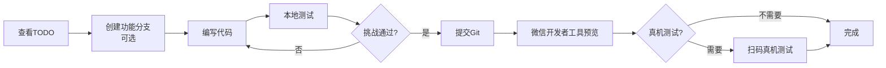

# 12 - 开发快速开始

> ⚠️ **【已归档·历史文档】** 本文是“从零开工”阶段的环境检查/TODO/工作流指南，代码已建成，**不代表当前状态**。开发/构建的活口径统一以 `开发文档/`（代码级）+ `上线相关/`（部署）为准；本文仅存档备查。

> **版本**: v1.0  
> **日期**: 2026-07-16  
> **目标读者**: 前端/后端开发人员（一人AI公司）  
> **文档作用**: 一站式开发指南，包含环境检查、TODO清单、工作流、常见问题

---

## 📋 目录

1. [环境检查清单](#1-环境检查清单)
2. [一键启动命令](#2-一键启动命令)
3. [TODO任务清单](#3-todo任务清单)
4. [开发工作流](#4-开发工作流)
5. [调试技巧](#5-调试技巧)
6. [常见问题FAQ](#6-常见问题faq)

---

## 1. 环境检查清单

### ✅ 必需软件

在开始开发前，请确认以下软件已安装：

| 软件 | 版本要求 | 安装状态 | 验证命令 |
|:--|:--|:--:|:--|
| Node.js | ≥18.x | ⬜ | `node -v` |
| npm | ≥9.x | ⬜ | `npm -v` |
| Taro CLI | ≥3.6.x | ⬜ | `taro --version` |
| PostgreSQL | 15.x | ⬜ | `psql --version` |
| Redis | 7.x | ⬜ | `redis-cli ping` → PONG |
| 微信开发者工具 | 最新版 | ⬜ | 手动打开 |
| Git | ≥2.x | ⬜ | `git --version` |

### 📦 安装步骤（如果未安装）

#### 1.1 安装Node.js和Taro

```bash
# 下载Node.js
# https://nodejs.org/zh-cn/download/

# 安装Taro CLI
npm install -g @tarojs/cli@3.6

# 验证
taro --version
```

#### 1.2 安装PostgreSQL 15

**Windows**:
1. 下载：https://www.enterprisedb.com/downloads/postgres-postgresql-downloads
2. 选择 PostgreSQL 15.x → Windows x86-64
3. 安装时设置并记住密码（自定义强密码，写入本地 `.env`，勿提交）
4. 端口：5432（默认）

**验证**:
```bash
psql -U postgres -c "SELECT version();"
```

#### 1.3 安装Redis 7

**Windows**:
1. 下载：https://github.com/tporadowski/redis/releases
2. 选择 `.msi` 安装包
3. 默认端口 6379

**验证**:
```bash
redis-cli ping
# 应返回: PONG
```

#### 1.4 安装微信开发者工具

1. 下载：https://developers.weixin.qq.com/miniprogram/dev/devtools/download.html
2. 安装后登录微信账号
3. 获取AppID（后续配置用）

---

## 2. 一键启动命令

### 🚀 完整启动流程

```bash
# ============================================
# 酷酷儿童故事 - 一键启动脚本
# ============================================

# 1. 进入项目目录
cd "d:\work\work\code\testsuit\公司\项目\酷酷儿童故事"

# 2. 检查PostgreSQL是否运行
# Windows服务中查看 PostgreSQL 15 是否启动

# 3. 检查Redis是否运行
# Windows服务中查看 Redis 是否启动

# 4. 启动NestJS后端
cd server
npm run start:dev
# 后端监听在 http://localhost:3000

# 5. 新开一个终端，启动Taro前端
cd ..
npm run dev:weapp
# 前端编译到 dist/ 目录

# 6. 打开微信开发者工具
# 导入项目: d:\work\work\code\testsuit\公司\项目\酷酷儿童故事\dist
# AppID: 使用测试号或你自己的AppID
```

### 📝 常用命令速查

```bash
# 前端开发
npm run dev:weapp          # 微信小程序开发模式
npm run build:weapp        # 微信小程序生产构建

# 后端开发
cd server
npm run start:dev          # 开发模式（自动重启）
npm run start:prod         # 生产模式

# 数据库
psql -U postgres -d kuku_stories  # 连接数据库

# Git
git status                 # 查看状态
git add .                  # 添加所有文件
git commit -m "feat: xxx"  # 提交
git push                   # 推送
```

---

## 3. TODO任务清单

### 🎯 Phase 1: MVP开发（P0优先级）

#### 前端任务

##### 基础框架
- [ ] **初始化Taro项目**
  ```bash
  taro init kuku-story
  cd kuku-story
  npm install
  ```
- [ ] **配置路由** (`src/app.config.ts`)
  - 底部TabBar配置（故事/歌曲/成长/家长）
  - 26个页面路由注册
- [ ] **创建全局样式** (`src/styles/global.scss`)
  - 引入design-tokens.json的颜色变量
  - 设置全局字体、间距

##### 核心页面（按依赖顺序）
- [ ] **GL-01 底部TabBar**
  - 4个Tab图标和文字
  - 选中态高亮（橙色）
  - 点击切换页面
  
- [ ] **S-01 故事首页**
  - 顶部搜索栏
  - 推荐轮播（8个故事）
  - 学科卡片网格（2列）
  - 调用索引(CDN静态): GET /index/generated_stories/_global.json（不走 /api/v1，见 11号 §1.1）

- [ ] **PL-01 故事播放器**
  - 封面图展示
  - 进度条（可拖动）
  - 播放/暂停按钮
  - 睡眠定时关闭功能
  - 调用索引(CDN静态): GET /generated_stories/{学科}/{分类}/{故事名}/segments.json（见 11号 §1.3）

- [ ] **M-01 歌曲首页**
  - 分类入口（学科启蒙/原创儿歌）
  - 调用索引(CDN静态): GET /index/songs/_global.json（见 11号 §4.1）

- [ ] **PL-02 歌曲播放器**
  - 歌词同步显示
  - LRC解析
  - 循环模式切换
  - 调用API: GET /api/v1/songs/{song_id}

- [ ] **G-01 成长首页**
  - 学习进度总览
  - 学科入口（识字/拼音/英语）
  - 四级阶段展示
  - 调用API: GET /api/v1/progress/summary?child_id={id}

- [ ] **C-01 家长中心**
  - 学习统计图表
  - 孩子档案管理
  - 调用API: GET /api/v1/parent/progress/weekly?child_id={id}

##### 公共组件
- [ ] **Button组件** (`src/components/Button/`)
- [ ] **Card组件** (`src/components/Card/`)
- [ ] **ProgressBar组件** (`src/components/ProgressBar/`)
- [ ] **Tag组件** (`src/components/Tag/`)
- [ ] **SearchBar组件** (`src/components/SearchBar/`)
- [ ] **EmptyState组件** (`src/components/EmptyState/`)

##### API服务层
- [ ] **封装Taro.request** (`src/services/api.ts`)
- [ ] **故事API** (`src/services/story.ts`)
- [ ] **歌曲API** (`src/services/song.ts`)
- [ ] **教育API** (`src/services/education.ts`)
- [ ] **用户API** (`src/services/user.ts`)
- [ ] **音频服务** (`src/services/audio.ts`)
- [ ] **本地存储** (`src/services/storage.ts`)

##### 状态管理
- [ ] **播放器状态** (`src/store/player.ts`)
- [ ] **用户状态** (`src/store/user.ts`)
- [ ] **学习进度状态** (`src/store/learning.ts`)

---

#### 后端任务

##### 基础搭建
- [ ] **初始化NestJS项目**
  ```bash
  npx @nestjs/cli new server
  cd server
  npm install @nestjs/typeorm typeorm pg @nestjs/config
  ```
- [ ] **配置PostgreSQL连接** (`src/config/database.config.ts`)
- [ ] **执行建表SQL**（见08-本地开发实施步骤.md第2.2节）
- [ ] **配置静态文件服务**（替代CDN）

##### API接口实现
- [ ] **微信登录API** (`src/modules/auth/`)
  - POST /api/v1/auth/login
- [ ] **静态文件服务**
  - GET /static/* (音频/图片/索引)
- [ ] **收藏API** (`src/modules/favorites/`)
  - GET/POST/DELETE /api/v1/favorites
- [ ] **播放历史API** (`src/modules/history/`)
  - GET/POST/DELETE /api/v1/history
- [ ] **学习进度API** (`src/modules/progress/`)
  - GET/POST /api/v1/progress
- [ ] **埋点API** (`src/modules/track/`)
  - POST /api/v1/track
- [ ] **家长中心API** (`src/modules/parent/`)
  - GET /api/v1/parent/dashboard
  - GET/PUT /api/v1/parent/settings

---

### 🟡 Phase 2: 完善功能（P1优先级）

- [ ] S-02 学科详情页
- [ ] S-03 故事列表页
- [ ] G-02 课程列表页
- [ ] G-03 课程详情页
- [ ] G-04 普通挑战页
- [ ] C-05 搜索页
- [ ] A-01 登录页
- [ ] U-01~U-05 通用状态页（空状态/加载态/错误页）

---

### 🟢 Phase 3: 优化与测试（P2优先级）

- [ ] 性能优化（图片懒加载、音频预加载）
- [ ] 单元测试（Jest）
- [ ] E2E测试（关键流程）
- [ ] 真机测试（iOS/Android）
- [ ] 提交微信审核

---

## 4. 开发工作流

### 🔄 日常开发流程



### 📝 具体步骤

#### Step 1: 查看TODO
打开本文档，找到对应的TODO项，勾选开始

#### Step 2: 编写代码
```bash
# 示例：创建故事首页
mkdir -p src/pages/story-home
touch src/pages/story-home/index.tsx
touch src/pages/story-home/index.scss
```

#### Step 3: 本地测试
```bash
# 前端
npm run dev:weapp

# 后端
cd server && npm run start:dev

# 微信开发者工具
# 编译 → 预览 → 检查Console和Network
```

#### Step 4: 提交Git
```bash
git add .
git commit -m "feat: 实现故事首页S-01"
git push
```

#### Step 5: 真机测试（可选）
1. 微信开发者工具 → 预览
2. 扫码在真机上测试
3. 打开调试模式查看Console

---

## 5. 调试技巧

### 🔍 Console调试

```typescript
// 打印日志
console.log('当前播放时间:', currentTime);
console.warn('音频加载失败');
console.error('API请求错误:', error);

// 查看对象
console.table(storyList);
console.dir(playerState);
```

### 🌐 Network抓包

**微信开发者工具**:
1. 点击顶部菜单 → 调试器
2. 切换到 Network 面板
3. 查看所有HTTP请求
4. 检查请求参数和响应数据

**常见问题**:
- 404: 检查URL是否正确
- 500: 检查后端日志
- CORS: 检查服务器域名配置

### 📱 真机调试

**步骤**:
1. 微信开发者工具 → 预览
2. 用手机微信扫码
3. 手机右上角 ··· → 打开调试
4. 查看Console和Network

**注意事项**:
- 真机无法访问 localhost，需配置内网穿透或使用测试服务器
- 音频后台播放需要在 app.json 中声明权限

### 🐛 常见Bug排查

**问题1: 音频播放失败**
```typescript
// 检查音频URL是否正确
console.log('音频URL:', audioUrl);

// 检查格式是否为MP3
// 检查文件是否存在于 static/ 目录
```

**问题2: 样式不生效**
```scss
// 检查SCSS变量是否正确引入
@import '@/styles/variables.scss';

// 检查类名是否拼写正确
<View className="story-home">  // 不是 storyHome
```

**问题3: API请求超时**
```typescript
// 检查后端是否启动
// 检查端口是否为3000
// 检查防火墙是否阻止

// 增加超时时间
Taro.request({
  url: 'http://localhost:3000/api/v1/xxx',
  timeout: 10000,  // 10秒
});
```

---

## 6. 常见问题FAQ

### Q1: 如何启用Mock数据？

**A**: 在 `config/dev.ts` 中设置：
```typescript
export default {
  env: {
    USE_MOCK: 'true',  // 改为 'false' 使用真实API
  },
};
```

Mock数据位于 `src/services/mock/` 目录。

---

### Q2: 音频文件放在哪里？

**A**: 
- **开发环境**: `production/audio/` 目录
- **后端映射**: NestJS ServeStaticModule 映射到 `/static`
- **访问URL**: `http://localhost:3000/static/audio/xxx/full.mp3`

---

### Q3: 如何修改API基础URL？

**A**: 在 `src/services/api.ts` 中修改：
```typescript
const BASE_URL = process.env.API_BASE_URL || 'http://localhost:3000';
```

或在 `.env` 文件中配置：
```bash
API_BASE_URL=http://localhost:3000
```

---

### Q4: 微信开发者工具报错"不在以下 request 合法域名列表中"？

**A**: 
1. 微信开发者工具 → 详情 → 本地设置
2. 勾选 **"不校验合法域名、web-view（业务域名）、TLS 版本以及 HTTPS 证书"**
3. 或者在微信公众平台配置服务器域名

---

### Q5: 如何实现后台播放？

**A**: 
1. 在 `src/app.config.ts` 中声明：
```typescript
export default defineAppConfig({
  requiredBackgroundModes: ['audio'],
});
```

2. 使用 `Taro.getBackgroundAudioManager()`:
```typescript
const bgAudio = Taro.getBackgroundAudioManager();
bgAudio.src = audioUrl;
bgAudio.play();
```

---

### Q6: 数据库连接失败？

**A**: 
1. 检查PostgreSQL是否启动
2. 检查 `.env` 中的配置：
```bash
DB_HOST=localhost
DB_PORT=5432
DB_NAME=kuku_stories
DB_USER=postgres
DB_PASSWORD=‹见本地 .env，不入库›
```

3. 测试连接：
```bash
psql -U postgres -d kuku_stories -c "SELECT 1;"
```

---

### Q7: 如何查看后端日志？

**A**: 
```bash
# 开发模式会自动输出日志
cd server
npm run start:dev

# 查看特定模块日志
# 在代码中添加 console.log()
console.log('[Auth Module] Login request:', data);
```

---

### Q8: 样式使用了SCSS变量但不生效？

**A**: 
1. 确保安装了 `sass`：
```bash
npm install sass
```

2. 确保正确引入变量文件：
```scss
@import '@/styles/variables.scss';

.story-home {
  background: $color-background;  // 使用变量
}
```

---

### Q9: 如何重置数据库？

**A**: 
```bash
# 删除数据库
psql -U postgres -c "DROP DATABASE IF EXISTS kuku_stories;"

# 重新创建
psql -U postgres -c "CREATE DATABASE kuku_stories;"

# 执行建表SQL
psql -U postgres -d kuku_stories -f "d:/work/work/code/testsuit/公司/项目/酷酷儿童故事/md/08-本地开发实施步骤.md"
# 注意：需要手动复制SQL部分执行
```

---

### Q10: Git提交时遇到中文乱码？

**A**: 
```bash
# 设置Git编码
git config core.quotepath false
git config i18n.commitencoding utf-8
git config i18n.logoutputencoding utf-8

# 设置终端编码
chcp 65001  # Windows CMD
```

---

## 🔗 相关文档

- [08-本地开发实施步骤.md](../08-本地开发实施步骤.md) - 详细的环境搭建和建表SQL
- [11-API接口文档.md](../11-API接口文档.md) - API接口详细定义
- [02-技术架构设计.md](../02-技术架构设计.md) - 技术选型和架构说明
- [09-页面清单与信息架构.md](../09-页面清单与信息架构.md) - 页面ID和路由配置
- [UI设计/UI设计方案.md](../UI设计/UI设计方案.md) - UI设计规范

---

## 📞 需要帮助？

如果遇到文档中未覆盖的问题：

1. 查看 [08-本地开发实施步骤.md](../08-本地开发实施步骤.md) 的详细说明
2. 检查微信开发者工具的Console和Network面板
3. 查看后端日志（`server/` 目录）
4. 参考Taro官方文档：https://taro-docs.jd.com/

---

**最后更新**: 2026-07-16 by AI Developer
